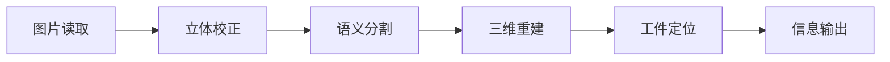

# 大工件定位

## end to end 流程图




## 文件介绍

**imgs文件夹**：保存测试图片或数据

**tools文件夹**：工具文件夹

**nets文件夹**:resnet/vgg等残差网络代码

**utils文件夹**:图像处理代码

**read_photos.py**：图片读取

**stereo_rectification.py**：立体校正

**semantic_segmentation.py**：语义分割

**reconstruction.py**工件维重建

**location_torch.py**：双目三维重建

**model_icp.py**：icp匹配及定位

**communicate.py**：前后端通信

**main.py**

## 环境配置与安装
### 实验配置
* CUDA==11.6
* Cudnn==8.3.2
* python==3.8.18
* torch==1.13.1+cu116
* torchaudio==0.13.1+cu116
* torchvision==0.14.1+cu116
* numpy==1.24.4 (>=1.20.0)
* MegEngine==1.13.0+cu111
* opencv-python==4.8.1.78
* opencv-contrib-python==4.8.1.78
* pillow==10.1.0
* chardet==5.2.0

### 依赖库安装
**pytorch等安装**
```bash
conda install pytorch==1.13.1 torchvision==0.14.1 torchaudio==0.13.1 pytorch-cuda=11.6 -c pytorch -c nvidia
```

**Megengine安装**

[Megengine下载地址](https://www.megengine.org.cn/whl/mge.html)
```bash
pip install MegEngine-1.13.0+cu111-cp38-cp38-manylinux2014_x86_64.whl 
```

```bash
pip install opencv-python
pip install opencv-contrib-python
pip install  Pillow
conda install -c conda-forge tensorboardx
pip install chardet
```

## 运行步骤
```bash
python communicate.py
```
