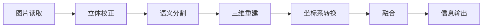

# 大工件定位

## end to end 流程图

## 文件介绍

**imgs文件夹**：保存测试图片或数据

**tools文件夹**：工具文件夹

**read_photos.py**：图片读取

* 输出：8个相机图片，图片大小2688x1520

**stereo_rectification.py**：立体校正

* 输入：8个相机图片
* 输出：8张立体校正完成后的图片

**semantic_segmentation.py**：语义分割

* 输入：8张立体校正后的图片
* 输出：语义分割图

**reconstruction.py**：三维重建

* 输入：8张校正图、语义分割图
* 输出：8张点云图

**coordinate_transformation.py**：坐标系转换

* 8张点云图
* 1张点云图

**fusion.py**：融合

* 1张点云图
* 1张点云图

**main.py**：项目的最后调用main.py里面的main()函数即可完成流程图所有功能
